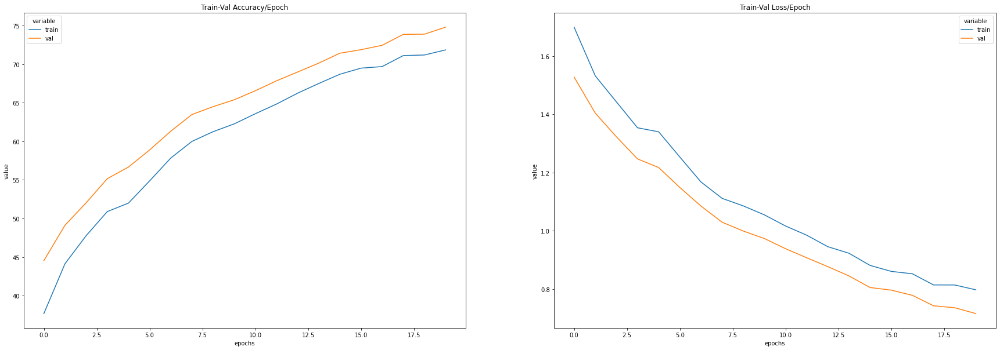
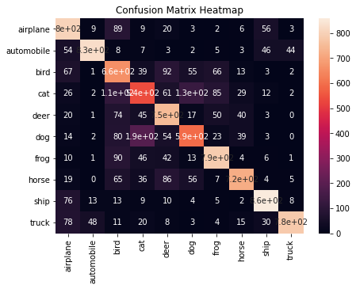
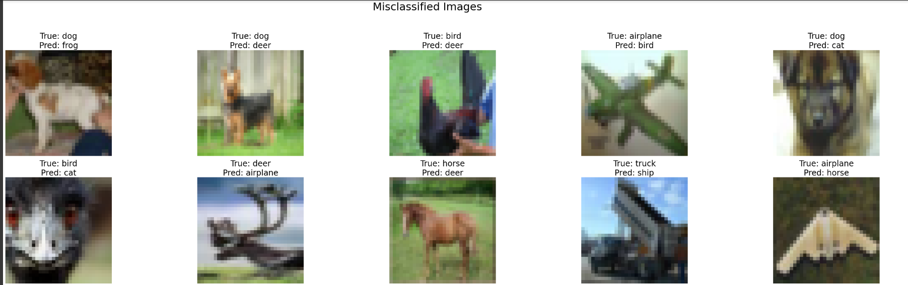
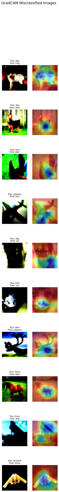

# Assignment 11

This assignment is on SpatialTransformer.

The folder structure is as follows -

```
- app
    - models
    - datasets
    - explainibility
    - utils
- main.ipynb
```

The `models` folder contains the code for ResNet. The `datsets` folder contains the PyTorch dataset for CIFAR10. The `explainibility` folder contains code for GradCAM and `utils` folder contains all the other misc functions such as train/test loops, visualization, transformations etc.

## Image Transformations


## Loss Acc Curves



## Confusion Matrix



## Misclassified Examples



## GradCAM


